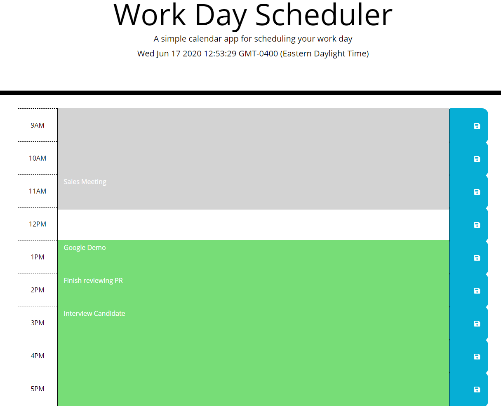

# Day Planner
****
This application can be used to manage daily schedules. It is built with JavaScript, jQuery, HTML and CSS. Users can enter what they need to get done for certain time slots
# About
****
Gray: Past
White: Current
Green: Future
 and save that input to local storage. Time slots change colors based on what time of day it is.
# Link to Deployed Application
****
https://graysondeese.github.io/DayPlanner/
# Screenshot
***

    
